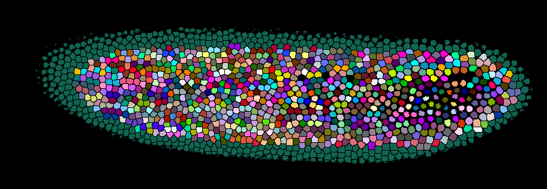
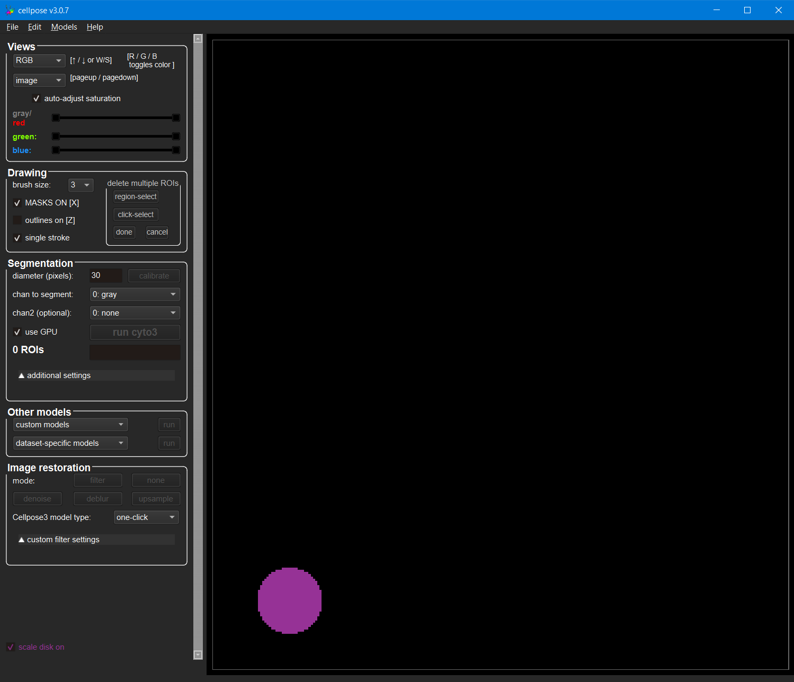

# 3D Image Analysis

*Lab authors: Hunter Elliott, Damian Dalle Nogare and Florian Jug* . 

<small>This file last updated 2025-04-02.</small>

---

## Learning Objectives

- Visualizing 3D data in Fiji and napari
- Basic segmentation on 3D images
- Image registration for 3D reconstruction
- Some ways to segment in 3D

**Lab Data** in [this folder](https://tinyurl.com/QI2025AnalysisLabData) (3D_Image_Analysis)

Remember to **unzip** the data folder after downloading.

---

## **Visualizing 3D data in napari**

- If not already done (on lab computers we have prepared it all), please 
  install napari by following [these instructions](https://napari.org/stable/tutorials/fundamentals/installation.html).

```{margin} Want to learn more about working with napari?
Check out the [documentation](https://napari.org/stable/usage.html) and [tutorials](https://napari.org/stable/tutorials/index.html#tutorials), or check them out on [the image.sc forum!](https://forum.image.sc/tag/napari)
```

- Sadly, there are many ways to start napari ([see here](https://napari.org/stable/tutorials/fundamentals/getting_started.html)). On our lab machines this means to:
  - Open an Conda Miniforge prompt (you can find it in the Windows Start menu).
  - Type `conda activate napari` to activate a conda environment we have prepared for you.
  - Type `napari` and hit enter!

- Out of the box, napari doesn't like to open images in usefuls ways.
  But behold, there is a solution.
  You can install a plugin that allows you to open many file-types the right way. 
  (Feel free to go on without installing this plugin and you will see what we are taling about).
  To install the plugin go to `Plugins > Install/Unistall Plugins`, then filter for 
  `aicsimageio`. Then click on "install" and restart napari.

- In napari, load the file `Drosophila_zstack-20x-medium.tif`, a 3-channel, 3D volume. 
  When it asks you which image loader to use, select the one we just installed.

- You can now switch to the 3D viewer by clicking on the 2D/3D toggle button (second from the left).
  

- Play around a bit, rotate the volume, change a few viewing options... enjoy!
  

## **Visualizing 3D data in Fiji**

- Open Fiji

- Load `Drosophila_zstack-20x-medium.tif`. As before, this is
  a 3-channel, 3D volume. The default visualization shows one z-plane
  and one channel at a time. There are a few other ways to visualize 3D
  data, some of which are listed below. Try them out, and see what are
  their advantages and disadvantages.

- **Orthogonal Views**. Go to `Image > Stacks > Orthogonal Views`. What
  are we seeing here? Can you understand what each window shows you? In
  which view is easiest to see the separation between nuclei? Why might
  that be?

<!-- - **Clear Volume**. *(If the plugin is not installed, you should enable
  the proper update site “ClearVolume”, update, and restart Fiji.)*
  Close the 3D Viewer. Go to Plugins \> Clear Volume(at the bottom of
  the list) \> Open in Clear Volume. Play around with the interface. In
  particular, change the values of VoxelDimension.X/Y/Z at the top right
  to see what happens. -->

- **BigDataViewer.** BDV is a “re-slicing” viewer that is included with
  Fiji and you can view your stack in it by going to
  `Plugins > BigDataViewer > open current image`. What might be the pros
  and cons of viewing images like this compared to a 3D view like in napari?

  - Do you see anything suspicious about the intensity values in this
    image when you rotate it in BDV? 
    If so, can you think of some possible explanations for this?

```{margin} Want to learn more about working with BigDataViewer?
Check out the [documentation](https://imagej.net/plugins/bdv/), or check them out on [the image.sc forum!](https://forum.image.sc/tag/BigDataViewer)
```

## **Registration for 3D Volume Reconstruction**

- Open the `mouse_brain_sections_downsampled32x_arpy.ome.tif` stack.
  You’ve seen a single tissue section from this brain before, but now
  we’re going to try to visualize the entire brain.

- Visualize this stack in in some way. This should look like most of a
  mouse brain but likely appears “squished”. Why? Look at the voxel
  dimensions - the actual voxel size in this image is (x,y,z) =
  (10.5,10.5,40) microns - adjust the voxel size (find out how if you 
  don't know) and try again! 
  Remember the discussion of voxel size calibration.

- Notice the misalignment between the tissue sections - this gives the
  brain a rough outline. You can also see this by scrolling through the
  image stack with the ImageJ viewer. We can fix this!

- Duplicate the original image stack. We will
  apply a stack registration to this duplicated stack. The plugin we
  will utilize will use the currently selected slice in the currently
  selected stack as a reference to register all the other slices, so
  scroll to a slice you think would serve as a good reference. Then, go
  to `Plugins > StackReg` (if StackReg is not installed,
  add 'BIG-EPFL' to the list of update sites, then update and restart
  Fiji). 
  What kind of transform do you think is best to align all these
  slices? Select it and then click OK. Be patient - it will take some
  time to finish. 
  
  ```{note}
  If you ever have to register multi-channel images, there is a plugin 
  called “HyperStackReg”. You can [find it here](https://github.com/ved-sharma/HyperStackReg) 
  and the installation instructions are on that page as well.
  ```

- Now visualize the registered stack and compare it to the original. 
  Does it look better? What might be necessary to further improve the 
  registration?

## **3D Object Segmentation, Shape and Intensity Measurements**

- Close all secondary Fiji windows and reload
  `Drosophila_zstack-20x-medium.tif`.

- Split the three channels by going to `Image > Color > Split Channels`.
  Close all but the second channel, which corresponds to nuclei. We are
  going to segment these nuclei via 3D marker-controlled watershed. As
  in 2D, we'll need 3 "images": marker, watershed surface, and mask.
  Typically we use nuclei as markers to segment cells, but here we will
  get all three images from the same source. Change the image type to
  32-bit (`Image > Type > 32-bit`). Create 3 copies of the stack (via
  `Image > Duplicate`), naming them "surface", "mask", and "marker".
  (Make sure the "*duplicate stack*" option is checked.)

- **Watershed surface**. Select the "surface" image. We can use the
  inverted nuclei channel as watershed surface (remember the watershed
  algorithm floods a surface from dark to bright areas). To make the
  segmentation smoother, however, we need to blur the image a bit. This
  is done via `Process > Filters > Gaussian Blur 3D`. Notice that now
  there are 3 sigmas to set, one for each dimension, and that they are
  in 'voxel' units, not microns. Should the 3 sigmas be the same? To
  answer this, go to `Image > Properties` and check the voxel size in
  x,y, and z. Now go to `Process > Filters > Gaussian Blur 3D`. Choose
  an appropriate sigma, and apply the filter. Visualize the result in
  3D. Try other sigmas (appropriately scaled) if necessary. Now invert
  the image: `Edit > Invert`. This is the watershed surface. To clean up
  your workspace, save it (`File > Save as > Tiff`) and close it.

- **Marker**. To find markers, we will treat the nuclei as "point
sources", and detect them by finding local maxima in the Laplacian of
Gaussian image. Select the "marker" image. We now compute the proper
sigma to locate the nuclei. We want to detect nuclei, so what should
we measure to determine this sigma? Now go to `Plugins > FeatureJ > FeatureJ Laplacian`, 
adjust the smoothing scale (don’t forget about the
voxel calibration!), and click OK. Candidates for markers are the
local minima in the resulting filtered image. To find them, go to
`Plugins > MorphoLibJ > Minima and Maxima > Regional Min & Max 3D`.
Select Regional Minima with Connectivity 26 and click Ok. What do you
think? Too many point sources in the background? We can filter them
using our previously computed mask. Load "mask" by dragging it into
Fiji. Now go to `Process > Image Calculator`. And multiply the mask by
the image with point sources. Save the result as "marker".

- **Mask**. This will restrict the area into which the watershed regions
  will grow. It can be obtained by thresholding a blurred version of the
  nuclei image, where the sigmas are a bit larger than the ones used
  above. Select the "mask" image. Apply a 3D gaussian filter (`Process >
  Filters > Gaussian Blur 3D`), with sigma a bit larger (say 50%) than
  the one used above. Threshold the result (`Image > Adjust >
  Threshold`). Choose a threshold such that the resulting mask contains
  all the nuclei, then click Apply. If prompted, click Convert to Mask.
  To clean up your workspace, save the result (`File > Save as > Tiff`)
  and close it.

  ```{hint}
  [MorphoLibJ](https://imagej.net/plugins/morpholibj) might not be installed 
  in your Fiji.
  You can, and will have to, install it by activating the `IJPB-plugins` plugin site.
  ```

- **Watershed**. Now close all secondary windows and load the "surface",
  "mask", and "marker" images. Go to `Plugins > MorphoLibJ > Segmentation > Marker-Controlled Watershed`. 
  Set Input, Marker, and Mask appropriately. Check all checkboxes. 
  Click Ok.

  - *Bonus:* Can you overlay the original image and watershed segmentation to
    visualize them simultaneously in 3D?

  ```{admonition} question
  :class: hint
  You had to make some decisions on parameters and if anything is off, things might
  not turn out very convincing. How well did this work for you? 
  Below a screenshot of one result we got... is your result comparable?
  ```
  

- **Shape Measurements**. Select the watershed image. Go to 
  `Plugins > MorphoLibJ > Analyse > Analyze Regions 3D`. Select desired 
  shape measurements and click Ok.

- **Intensity Measurements**. Go to `Plugins > MorphoLibJ > Analyze > Intensity Measurements 2D/3D`. 
  Which image should you set as Input? Which as Labels? Check the 
  desired measurements and click Ok.

## **3D Crop**

- This is useful if the data size is big and you want to rapidly test
  your analysis options before applying them to the larger set.

- Re-open the image you've been working with. Go to 
  `Image > Color > Split Channels`. Select channel 2. 
  Go to `Plugins > Stacks > Crop (3D)`. 
  Check "Three pane view" and uncheck "Change origin". Click Ok.
  In the Crop Options window, check all options under "Also crop these
  images". Set the bounding boxes as desired and click Crop.

- Merge the resulting channels (`Image > Color > Merge Channels`), and
  visualize the result in 3D if interested.

## **3D Pixel Classifier Choose-your-own-adventure**

The goal here is to use machine learning to attempt to segment closely
spaced nuclei. You have two options for how to proceed. For example, ilastik 
or Labkit. If you have time, try both!

### Labkit

Labkit can also perform 3D segmentation with a random forest pixel
classifier, and it lets you work right in Fiji, which must feel like
home at this point. It visualizes the data with BigDataViewer which you
used earlier and can handle very large datasets. 

```{margin} Want to learn more about working with Labkit?
Check out the [documentation](https://imagej.net/plugins/labkit/), or check them out on [the image.sc forum!](https://forum.image.sc/tag/Labkit)
```

- This step is not needed on the course computers, but on a new machine, 
  you can install Labkit by going to `Help > Update` and add the “Labkit” 
  update site, and restart Fiji.

- Open `drosophilus_floriansus.tif` and then go to `Plugins > Labkit > Open current image`. 
  You can access more options for viewing the data
  by clicking “settings” in the upper left corner.

- After you’ve annotated a few areas of foreground and background, in
  the lower left “Segmentation” box you’ll need to select the pixel
  classifier and click the `▶` button to train the model and see the
  current result.

- To handle large datasets, the dataset is broken up into blocks and
  Labkit only makes predictions on the currently visible blocks. When
  your done, if you want to export the entire segmentation, click the
  drop-down arrow next to the pixel classifier in the lower left
  window - there you’ll see options to segment the entire dataset and
  save the result.

### ilastik

```{margin} Want to learn more about working with ilastik?
Check out the [documentation and tutorials list](https://www.ilastik.org/documentation/), or check them out on [the image.sc forum!](https://forum.image.sc/tag/ilastik)
```

- Open `drosophilus_floriansus.tif`. If you want to keep things simple you
  can select a few crops in a small area containing a few dozen nuclei.
  Export the image to .tiff using `File > Save as > .tiff`.

- Create a new pixel classification project in ilastik and load in the
  .tiff stack. Train a model that highlights the nuclei. What classes
  should you label? What output of the model should you use as watershed
  surface?

- When you’re done, try loading the result into Fiji or napari and look
  at the result!

### Are we happy with these results?

- Are your nuclei all perfectly separated? If not, what method have you
  learned that might help you split them? What output of the model would
  you use to do that?

- Have you learned about other machine learning approaches that might
  handle closely spaced nuclei better? What are they and what are their
  pros and cons relative to this approach?

- Once you’re happy with your result, export the segmentation and
  overlay it with the raw data as a composite image. Then visualize it
  with your favorite 3D visualization tool from earlier in the lab.

## 3D instance segmentation

### CellPose

```{margin} Want to learn more about working with Cellpose?
Check out the [documentation](https://cellpose.readthedocs.io/en/latest/), or check them out on [the image.sc forum!](https://forum.image.sc/tag/Cellpose)
```

- We have seen in the lecture that CellPose, a 2D segmentation approach, can segment 3D data by segmenting orthogonal 
  2D slides and merging them into a consensus 3D segmentation. Interesting! Let's try!
  In tomorrow's deep learing lab, we will use cellpose more extensively, including fine-tuning a model to work better on our data. But for today, we will just use the default model. 

- Cellpose is a python based program. We will use python and conda more tomorrow, but for now we have installed cellpose for you using the miniforge open-source python package manager.

- Open a terminal by going to the search bar in windows and typing `miniforge`. Select the option `miniforge prompt`, and a black terminal window should appear. 
- In miniforge, cellpose lives in it's own space, called an environment. You can activate the CellPose environment by typing
  `conda activate cellpose`. Once this happens, the text of the terminal prompt should say something like `(cellpose)`.

- Start CellPose by typing `cellpose --Zstack` (because we will be working with 3D data, we need to add the 'flag' `--Zstack` sot htat Cellpose knows hoe to interpret the additional dimension (z) of the image). 

- You should see a window that looks like this: 

- open your image (`drosophilus_floriansus_single_t.tif`) by dragging it into the cellpose window. Note that cellpose expects a certain 'object size', determined by the `diameter (pixels)` parameter/ What size should we use? Look at the scale circle on the bottom left to estimate a good parameter. How could this change when we are doing 3D segmentation? (Remember that what we're actually doing is sequential 2D segmentation along each image axis)

- Once you have decided on a diameter, run a segmentation by clicking `run cyto3`. This will apply the `cyto3` pre-trained cellpose model to the image. Note that it might take some time to fully segment the image. You can check on the progress by looking at the terminal window.

- How was your segementation? Do any of the other cellpose models work better? Try some other models. Tomorrow we will play around more with cellpose, including retraining a model so that it works better!

  ```{hint}
  Are there any preprocessing steps that could help to better 
  segment this data? Try some. Maybe in Fiji Maybe things we did also 
  in earlier exercises...
  ```
  <!-- note to future us: a bit of guassian smoothing on the raw data makes CellPose perform much better. -->

  ```{warning}
  Check if the results on all focal planes works equally well.
  In case you observe that deeper nuclei are not or less well segmented, 
  what could the reason be and how could you fix it?
  ```
  <!-- note to future us: deeper focal planes are much dimmer... we can use bleach correction in Fiji to make that better... -->


## **Bonus Exercise**

- Think of something you want to segment/detect and measure in the 3D
  data you’ve acquired in the lab and go for it! Come up with a plan,
  and if you run into trouble just ask us!